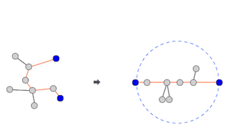

## Info

<a href="https://www.acmicpc.net/problem/1967" rel="nofollow">1967 트리의 지름</a>

## ❗ 풀이


둘 사이 경로가 가장 긴 노드를 끝 점으로 위의 그림과 같이 원을 만들면,<br/>
어떤 노드에서든 DFS로 가장 먼 노드를 찾으면 끝 점 노드가 나오게 된다.<br/>
그래서 해당 문제는
1. 한 노드를 DFS하여 가장 먼 노드를 구한다. (이때 구한게 끝 점 노드 중 하나)
2. 구한 노드를 DFS하여 가장 긴 거리를 구한다.

이렇게 2번만 DFS하면 답이 나오는 문제이다.

## ❗ 추가 지식

이때까지 푼 문제들은 input값이 큰 적이 많이 없어, 메모리 제한에 신경을 쓴 적이 없었다.<br/>
이번에 문제를 풀면서 메모리 초과가 났는데 총 n이 10000까지 받을 수 있어
int형 이차원 배열을 만들었을 경우 10000 X 10000 X 4Byte = 400MB로 128MB를 초과하게 된다.<br/>
input 값 범위와 메모리도 확인을 잘하도록 하자.<br/>
<br/>
자바 ArrayList를 이용해 인접리스트를 쉽게 구현할 수 있다.<br/>
```java
tree = new ArrayList[n + 1];

for (int i = 0; i <= n; i++) {
    tree[i] = new ArrayList<>();
}
```
## 🙂 마무리

비효율적이지만 노드마다 DFS를 돌려 값을 구할 수 있는 문제였다.<br/>
왠지 그렇게 하면 시간초과 날까봐 시도할 생각도 안했다는게 아쉬웠다.<br/>
문제에 답이 다 있어서 정석 풀이를 보고 너무 놀랐다.<br/>
그리고 오랜만에 인접리스트로 트리를 만들면서 인접리스트에 대해 다시 배우고 갈 수 있어서 좋았다.<br/>
