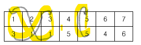

## Info

<a href="https://www.acmicpc.net/problem/2668" rel="nofollow">2668 숫자고르기</a>

## ❗ 풀이

우선 집합에 포함되는지 안되는지를 알기 위해선
아래와 같이 둘째 줄의 수를 이용해 해당 첫째 줄을 갔을 때
결국 자기 자신으로 돌아와 루프가 생기는 것을 이용하였다.<br/>  


모든 배열을 돌면서 루프가 생기는지(자기자신으로 돌아오는지) 체크를 하였다.

```java
static void check(int p) {
		cnt++;
		
		if(arr[p] == start) {
			sum+=cnt;
			cnt = 0;

            visited[p] = true;
            p = arr[p];
    
            while(arr[p] != start) {
                visited[p] = true;
                p = arr[p];
            }
            return;
		}
        
        if(cnt == (n - sum)) {
            cnt = 0;
            return;
        }
		//...
	}
```
자기 자신으로 돌아왔을때 루프에 포함되는 수들을 while문을 통해 visited true로 바꿔주고 함수를 끝내었다.<br/>
이렇게 해서 visited가 true인 배열 인자는 check함수로 들어오지 않게 하였고,<br/>
탈출조건에 cnt == (n-sum) 을 하여 루프를 돌지않으면 빠르게 함수를 빠져나올 수 있게 하였다.<br/>

## ❗ 추가 지식


## 🙂 마무리

규칙을 생각하고 푸니까 이번주 문제 중 가장 쉽게 풀었다.<br/>
그런데 출력 부분에서 visited를 어떻게 체크해야,
함수가 끝나고 나서 다시 한번더 집합에 포함되는 수(집합 인자)를 체크안하고 바로 출력할
준비가 되게 할 수 있는지 고민을 많이 했다.<br/>
결국 몰라서 다른 사람들 답을 확인해 보았는데 나는 한번 돌때 루프의 수들을 다 구하는 거였고,
다른 사람들을 해당 수가 집합에 포함되는지 그 수만 체크하였기에 DFS함수를 통해서
따로 반복문없이 바로 집합 인자를 구할 수 있었다.<br/>


