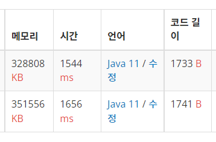

## Info

<a href="https://www.acmicpc.net/problem/1647" rel="nofollow">1647 도시 분할 계획</a>

## ❗ 풀이

두개의 마을로 나눠야 하는데 유지비를 적게 하기위해선 우선 MST를 구하고 
그 간선들 중 가장 가중치가 큰 길을 잘라내 유지비가 가장 적게 들도록 했다. 

크루스칼은 가중치가 작은 길부터 찾으니까 원래 목표인 N - 1 개의 길을 찾는 것에서 N - 2길을 찾으면 길을 다 찾은 걸로 알고리즘을 구현했다. 
프림은 minR에 해당 집에 연결되는 가장 작은 가중치가 저장된 배열이 있어, 그 배열 중 가장 큰 값을 찾아 원래 MST 전체 가중치에서 빼주었다. 

## ❗ 추가 지식

없음

## 🙂 마무리
1. Kruskal 알고리즘
2. Prim 알고리즘

처음에 프림은 최소 가중치를 저장하는 배열을 갖고 있어 프림으로 푸는게 더 낫겠다고 생각해서
프림으로 풀었는데  
생각해보니 그 배열 중 가장 큰 값을 골라야하는 한 단계를 더 해야 한다는 걸 깨달았다. 
크루스칼은 간선 가중치가 작은 순으로 고르기 때문에 간선 개수가 v-2가 되면 답을 출력하면 되기에
따로 원래 알고리즘에서 추가할 단계가 없다. 
그래서 크루스칼로 바꾸고 백준에 둘다 내보았는데 생각만큼 드라마틱하게 효율적이진 않았다. 